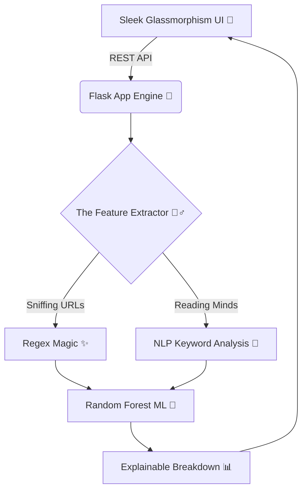

<div align="center">
  
  <br><br>
  <h1>🎣 PhishGuard AI <br> <span style="font-size: 18px; color: #7c6df0;">Because trusting every email is a terrible idea.</span></h1>
  
  <p>
    <strong>A shockingly smart, Glassmorphism-dripped AI that catches scammers before they catch your bank details.</strong>
  </p>

  <p>
    <a href="https://python.org"></a>
    <a href="https://scikit-learn.org"></a>
    
  </p>
</div>

<br>

## 🛑 Stop Right There, Scammer!
Ever looked at an email from your "CEO" asking for $50,000 in iTunes gift cards and thought, *"Hmm, seems legit"*? 

**PhishGuard AI** is here to save you from yourself. We don't just say "this looks bad"—we use **Explainable AI (XAI)** to tell you exactly *why* it's bad. Oh, and we trace the scammer's IP and drop a pinpoint on a gorgeous 3D Live Threat Map. Take that, cybercriminals! 🥷💥

---

## ✨ Features That Make You Go "Whoa"

<details>
<summary><b>🎬 The Cinematic Splash Intro & Logo Merger 💫</b> <i>(Click to expand!)</i></summary>
<br>
Witness an ultra-premium dark glass command center startup. On boot, glowing minimalist icons emerge one-by-one representing threat scanning, neural AI nodes, and shield guards. When loading completes, they dynamically expand, slide together, and merge into the unified brand emblem with a radial glimmer flash before revealing the active dashboard.
<br><br>

</details>

<details>
<summary><b>👀 The "Glassmorphism" UI Command Center</b> <i>(Click to expand!)</i></summary>
<br>
We didn't just build a security tool; we built a futuristic command center. Enjoy a beautiful translucent glass system featuring responsive multi-page navigation, smooth CSS animations, volumetric glows, and custom neon styles that react dynamically to interaction.
</details>

<details>
<summary><b>🧠 Big Brain AI (Explainable ML)</b> <i>(Click to expand!)</i></summary>
<br>
Instead of a black-box "trust me bro" score, our Random Forest classifier breaks down the threat using 19 distinct features. It catches structural anomalies (like raw IP addresses) and psychological manipulation tactics (Urgency, Fear, Authority) and delivers clear explainable graphs.
</details>

<details>
<summary><b>🌍 Live Threat Map Auto-Flight 🛫</b> <i>(Click to expand!)</i></summary>
<br>
Drop a sketchy URL into the dashboard. Watch as our backend resolves the IP, and the frontend instantly swoops across a beautiful Leaflet.js globe to drop a giant red pin exactly where the server is located, supplemented by a localized live active botnet threat intelligence feed. <i>*pew pew*</i> 🎯
</details>

<details>
<summary><b>📑 Full Report Export & Threat Auditing 📊</b> <i>(Click to expand!)</i></summary>
<br>
Instantly download comprehensive threat analysis reports with a single click. Exports all machine learning risk factors, Geo-IP parameters, confidence scores, and neural feature weights in clean, auditable JSON format directly from history logs.
</details>

<details>
<summary><b>🎶 Audio Security Ambience & Synths 🎵</b> <i>(Click to expand!)</i></summary>
<br>
Immerse yourself completely into a digital command center. Includes background cyber-synth operations music and interactive sound effects loops with quick mute/volume sliders on the settings tab.
</details>

---

## 🛠️ The Tech Sauce

We kept it ridiculously lightweight. No crazy build steps. No Webpack configuration tears. Just pure, unadulterated Python and Vanilla JS magic.



---

## 🚀 How to Launch This Bad Boy

You're 3 commands away from feeling like an elite cybersecurity analyst. 

### 1. Grab the Code
```bash
git clone https://github.com/AyushPatwa11/PhishGaurd_AI.git
cd PhishGaurd_AI/backend
```

### 2. Fuel the Engine
```bash
pip install -r requirements.txt
```

### 3. Ignite! 🚀
```bash
python app.py
```
👉 Open **`http://localhost:5000`** in your browser and start interrogating suspicious links!

---

## 🤖 Talk to the API (For the Nerds)

Don't want to use the UI? Fine. Be that way. Our REST API is ready for your scripts.

| Method | Endpoint | What it does |
|--------|----------|--------------|
| `POST` | `/api/predict` | Feed it `{text, url}` and get a terrifyingly accurate breakdown of the scam. |
| `GET` | `/api/examples` | Bored? Get a list of mock CEO fraud and delivery scams to play with. |
| `GET` | `/api/live-threats`| Gives you live coordinates of Botnet C2 servers. Great for party tricks. |

---

<div align="center">
  
  <br><br>
  <i>Crafted with excessive caffeine and ❤️ by <a href="https://github.com/AyushPatwa11">AyushPatwa11</a>.</i>
</div>
