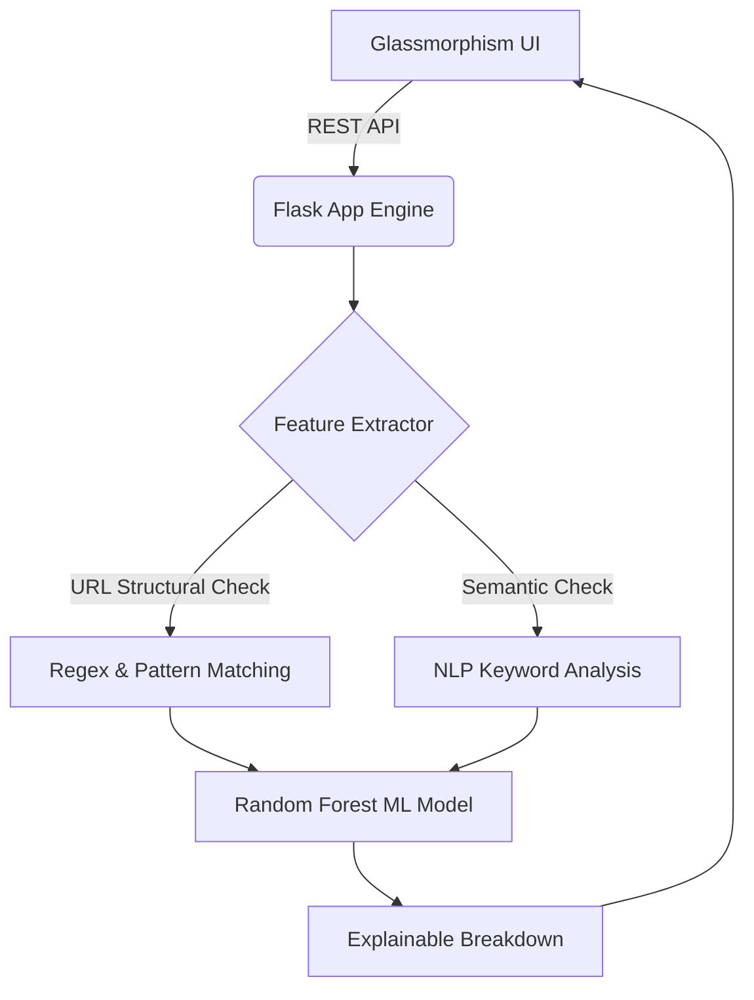

<div align="center">
  
  <br>
  <h1>🛡️ PhishGuard AI <br> <span style="font-size: 20px; color: #7c6df0;">Next-Gen Threat Intelligence & Behavioral Phishing Detection</span></h1>
  
  <p>
    <strong>Zero-Day Phishing Detection Powered by Explainable AI (XAI) and Live Threat Feeds.</strong>
  </p>

  <p>
    
    
    
    
  </p>
</div>

<br>

## ✨ Interactive & Animated UI
PhishGuard isn't just a backend engine—it features a stunning, state-of-the-art **Glassmorphism Single-Page Application (SPA)** that visualizes threats in real-time.

* **Sleek Micro-Animations**: Smoothly staggered slide-ins, pulsing threat indicators, and dynamic progress bars.
* **Live Global Threat Map**: A beautifully rendered Leaflet.js map tracking real Botnet C2 servers globally, complete with a randomized auto-flight camera and live intercept logs.
* **Responsive Routing**: Instant page switching between Home, Dashboard, Map, History, and Education Center without ever reloading the browser.

---

## 🚀 Core Features

### 🧠 1. Explainable AI Engine (XAI)
* **19-Point Feature Extraction**: Extracts both structural URL anomalies (e.g., suspicious TLDs, raw IPs) and semantic text manipulations (e.g., CEO fraud, urgency, fear tactics).
* **Random Forest Classifier**: Analyzes the extracted vectors and computes a deterministic threat probability.
* **Transparent Scoring**: Displays the top features that contributed to the score alongside real-world psychological manipulation tactics (Authority, Scarcity, Fear).

### 🌍 2. Live Global Threat Map & IP Tracking
* **Real Threat Data**: Consumes live threat feeds to plot active Botnet Command & Control servers.
* **Target Geolocation**: Analyzes a suspicious URL in the dashboard, resolves its underlying IP, and instantly traces it to a physical city and country.
* **"Track on Map" 🎯**: One-click tracking automatically flies the map camera to the attacker's physical coordinates and drops a red-alert pin!

### 📥 3. History & Export Capabilities
* **Session Memory**: Auto-saves every scan locally for easy review.
* **One-Click Exports**: Download raw CSV logs of your history, or generate structured text-based Threat Reports directly from the dashboard.

---

## 🛠️ Architecture

A hyper-efficient, unified stack without the overhead of heavy JS frameworks:



---

## 💻 Installation & Setup

PhishGuard AI serves both the robust API and the frontend directly through Flask. No Webpack, no NPM installs required!

### 1. Clone & Enter
```bash
git clone https://github.com/AyushPatwa11/PhishGaurd_AI.git
cd PhishGaurd_AI/backend
```

### 2. Install Dependencies
```bash
pip install -r requirements.txt
```

### 3. Launch the Engine
```bash
python app.py
```
*Open **`http://localhost:5000`** in your browser and prepare to be amazed!*

---

## 📡 API Reference

You can interact with the engine headlessly:

| Method | Endpoint | Description |
|--------|----------|-------------|
| `POST` | `/api/predict` | Submit `{"text": "...", "url": "..."}` for full XAI breakdown and IP geolocation. |
| `GET` | `/api/examples` | Fetch real-world template scenarios (CEO Fraud, KYC Scams, Safe Corporate Emails). |
| `GET` | `/api/live-threats`| Get live Botnet C2 server coordinates (supports `scope=near_me` / `global`). |

---

<div align="center">
  <i>Built with ❤️ by AyushPatwa11 to make the web a safer place.</i>
</div>
